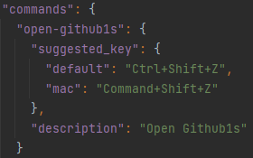

# Github1s Chrome Extension

This is the **unofficial** Github1s chrome extension which provides a popup and a shortcut key to open the current
github repository in Github1s's Visual Studio Code layout.

## Screenshot


It's a very basic and easy chrome extension that can help you to understand the process of how chrome extensions work
and are built.

Although, I can provide a ```.crx``` of the extension to easily install it but Chrome doesn't allow external extensions.

## Usage of the extension

1. Clone or download this repo as a zip file.
2. Extract the files into a folder.
3. Open [Chrome Extensions Page](http://Chrome//:extensions).
4. Select Developer Mode from top-right corner of the tab.
5. Click on ```Load Unpacked``` and select the folder which consists of these files.

## Working with the Extension

1. Clone the repo.
2. Open the ```index.html```.
3. Read the comments and start working. 

## To change the shortcut keys

1. Clone the repo.
2. Open the ```manifest.json``` file.
3. Set your key combo.


